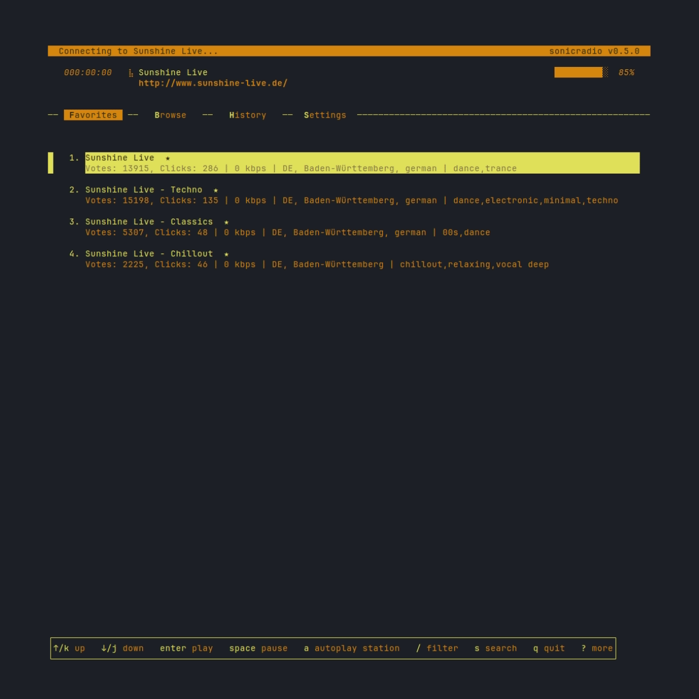

# SonicRadio

A TUI radio player making use of [Radio Browser API](https://www.radio-browser.info/) and [Bubbletea](https://github.com/charmbracelet/bubbletea).



## Installation

- ### Install using go:

  ```
    go install github.com/dancnb/sonicradio@latest
  ```
- ### Clone this repository and build from source.

  Some additional prerequisites are needed based on the platform (ex: CGO required for non-Windows), since this project uses <https://github.com/gopxl/beep>, respectively <https://github.com/ebitengine/oto> for the internal player implementation.

- ### Optional third-party backend players:

  One of the following tools must be installed and available in the PATH:
  - Mpv : <https://mpv.io/>
  - FFplay : <https://ffmpeg.org/ffplay.html>, comes bundled with ffmpeg
  - VLC: <https://www.videolan.org/vlc/>
  - MPlayer: <http://www.mplayerhq.hu/design7/dload.html>
  - Music Player Daemon: <https://www.musicpd.org/>
  
- ### Download binaries available in [Releases](https://github.com/dancnb/sonicradio/releases) page.

## Usage

After the installation, the command to run the application:

```
    sonicradio
```

Available options:

```
      -debug: creates a log file "sonicradio-[epoch millis].log" in OS specific temp dir
```


### Keybindings

| Key(s)      |                Action |
| :---------- | --------------------: |
| ↑/k         |                    up |
| ↓/j         |                  down |
| ctrl+f/pgdn |             next page |
| ctrl+b/pgup |             prev page |
| g/home      |           go to start |
| G/end       |             go to end |
| enter/l     |                  play |
| space       |          pause/resume |
| -           |              volume - |
| +           |              volume + |
| ←/<         |        seek backwards |
| →/>         |          seek forward |
| i           |          station info |
| f           |      favorite station |
| a           |      autoplay station |
| A           |    add custom station |
| d           |        delete station |
| p/shift+p   | paste deleted station |
| /           |        filter results |
| s           |      open search view |
| #           |  go to station number |
| esc         |     go to now playing |
| shift+tab   |        go to prev tab |
| tab         |        go to next tab |
| v           |           change view |
| ?           |           toggle help |
| q           |                  quit |


## License

Sonicradio is licensed under the [MIT License](LICENSE).

### Third-party dependencies

[Bubbletea](https://github.com/charmbracelet/bubbletea/blob/master/LICENSE) MIT License

